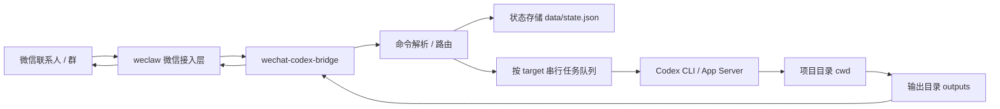

# WeChat Codex Bridge 项目说明

用途：本项目用于在本机把微信消息路由到多个 Codex 项目线程。本文档是唯一项目说明文档，合并了项目说明、使用说明、安全与备份、命令说明和下一步实施计划。

本地路径：`F:\01.AI\20.WechatCodexBridge`

GitHub 仓库：`https://github.com/lthirty/WechatCodexBridge`

当前说明：本地目录暂未初始化为 Git 仓库，未执行提交或推送。

## 1. 最高原则

本项目最高原则：不能影响电脑、Codex、微信和其他软件的正常工作。

必须遵守：

- 默认 `dryRun=true`，不真实发送微信消息，不真实调用 Codex 执行。
- 所有状态写入前自动备份 `data/state.json` 到 `backups/`。
- 只允许访问 `config.json` 中 `allowedRoots` 覆盖的项目目录。
- 不修改 `%USERPROFILE%\.codex`、微信安装目录、系统代理、系统服务和注册表。
- 不读取或记录密钥、Cookie、微信数据库、聊天隐私数据库。
- 真实微信发送只允许白名单会话，第一阶段只允许 `filehelper`。
- 不执行删除、推送、安装、系统配置修改等危险动作；后续如需要必须增加确认机制。

## 2. 项目定位

一句话说明：本项目是一个本地微信到多 Codex 项目线程的安全路由桥。

目标用户：需要通过微信远程给 Codex 项目线程下任务、查看结果、回传图片和文件的个人开发者。

核心场景：

- 把 `文件传输助手` 当作一个线程映射窗口。
- 通过 `/list` 或 `/ls` 查看 Codex App 中已有项目和对应线程。
- 通过 `/ent 项目名/线程名` 进入一个 Codex 线程映射，不需要加引号。
- 通过 `/exit` 退出当前线程映射，回到控制模式。
- 进入线程后，普通微信消息会向当前 Codex 目标发任务。
- 通过 `/ask <alias>` 向指定目标临时发任务。
- 通过 `/sendlast 5` 回传项目输出目录最新图片。

服务边界：

- 本项目负责路由、状态管理、任务排队和适配外部工具。
- 微信收发由 `weclaw` 或兼容 HTTP/CLI 工具负责。
- Codex 执行由 Codex CLI 或后续 app-server 适配负责。

明确不做：

- 不做微信 GUI 自动化作为主方案。
- 不破解微信协议。
- 不绕过 Codex 权限模型。
- 不自动修改系统网络、Codex 配置或微信配置。

## 3. 当前实际架构

```text
20.WechatCodexBridge/
├─ src/
│  ├─ server.js
│  ├─ router.js
│  ├─ store.js
│  ├─ codex-runner.js
│  ├─ wechat-client.js
│  ├─ file-finder.js
│  ├─ security.js
│  └─ config.js
├─ scripts/
│  ├─ start.ps1
│  ├─ stop.ps1
│  └─ status.ps1
├─ data/
├─ backups/
├─ logs/
├─ docs/
│  └─ WechatCodexBridge.md
├─ 启动-WechatCodexBridge.cmd
├─ 关闭-WechatCodexBridge.cmd
├─ 状态-WechatCodexBridge.cmd
├─ config.example.json
├─ config.json
└─ package.json
```

## 4. 目标架构



执行原则：

- 同一 `target` 串行执行，避免一个 Codex 线程内多任务互相打断。
- 不同 `target` 可并行执行。
- 第一阶段只接入 `文件传输助手`，不接入其他好友或群聊。
- `文件传输助手` 只保存“当前进入哪个线程”的映射状态，不替代 Codex 自身线程存储。
- “完全同步”的含义是：进入线程后，微信普通消息进入该线程队列，Codex 执行结果回发到文件传输助手；历史消息是否完整同步取决于真实 Codex 适配器能力。

## 5. API 设计

本地监听：`http://127.0.0.1:18731`

接口：

- `GET /health`：健康检查。
- `POST /wechat/message`：接收微信消息事件。

请求示例：

```json
{
  "sessionId": "filehelper",
  "displayName": "文件传输助手",
  "text": "/status"
}
```

## 6. 一键启动和一键关闭

### 6.1 双击启动

双击：

```text
F:\01.AI\20.WechatCodexBridge\启动-WechatCodexBridge.cmd
```

启动脚本会执行：

- `npm run check`
- 检查 `18731` 端口是否被占用
- 启动 `node src/server.js`
- 启动 `scripts/filehelper-gui.ps1`
- 写入 `data/bridge.pid`
- 写入 `data/filehelper-gui.pid`
- 调用 `/health` 验证服务

启动后包含两个受控进程：

- `WechatCodexBridge`：本地 HTTP 桥服务。
- `FileHelper GUI adapter`：只监听和回复微信 `文件传输助手` 窗口。

### 6.2 双击关闭

双击：

```text
F:\01.AI\20.WechatCodexBridge\关闭-WechatCodexBridge.cmd
```

关闭脚本只会停止命令行中包含 `20.WechatCodexBridge` 的 Node 进程，以及命令行中包含 `filehelper-gui.ps1` 的 PowerShell 适配器进程，不会停止其他 Node、Codex、微信或系统进程。

### 6.3 查看状态

双击：

```text
F:\01.AI\20.WechatCodexBridge\状态-WechatCodexBridge.cmd
```

或运行：

```powershell
cd F:\01.AI\20.WechatCodexBridge
npm run status
```

### 6.4 命令行启动和关闭

```powershell
cd F:\01.AI\20.WechatCodexBridge
powershell -ExecutionPolicy Bypass -File .\scripts\start.ps1
powershell -ExecutionPolicy Bypass -File .\scripts\stop.ps1
```

## 7. 命令功能说明

`/help`

显示可用命令清单。

`/list`

列出 Codex App 本地线程索引中的项目线程，`*` 表示当前已经进入的线程。

兼容短命令：`/ls`

兼容旧命令：`/targets`

`/ent <项目名/线程名>`

进入指定项目线程。进入后，文件传输助手中的普通消息会发送到这个线程，线程回复也会回到文件传输助手。

示例：

```text
/ent edu-main
/ent 创意设计及验证
```

兼容旧命令：`/use <alias>`

`/exit`

退出当前线程映射，文件传输助手回到控制模式。退出不会删除线程配置，后续仍可通过 `/ent` 再次进入。

`/status`

显示当前微信会话状态，包括是否已经进入线程、当前目标、项目目录、线程 ID 和输出目录。

`/bind <alias> <cwd> <thread_id> [output_dir]`

新增或更新一个可进入的 Codex 目标，并自动进入该目标。

示例：

```text
/bind edu-main F:\01.AI\18.EduEntry 019e3449-ef5c-7442-bcce-60798383209a F:\01.AI\18.EduEntry\outputs
```

`/ask <alias> <message>`

向指定目标发一次任务，不切换当前激活目标。

示例：

```text
/ask edu-main 总结当前项目状态
```

`/sendlast <n>`

从当前目标的 `output_dir` 中查找最新 `n` 张图片并回传。当前 `dryRun=true` 时只返回文件名，不真实发微信。

示例：

```text
/sendlast 5
```

`/unbind <alias>`

解绑当前微信会话中的一个目标。日常退出线程应优先使用 `/exit`，不要用 `/unbind`。

普通消息

如果文件传输助手已经通过 `/ent` 进入线程，直接发送普通文本会进入该线程任务队列。如果已经 `/exit`，普通文本不会发送到 Codex。

示例：

```text
继续优化首页分享按钮，并生成截图
```

## 8. 当前配置

配置文件：

```text
F:\01.AI\20.WechatCodexBridge\config.json
```

当前安全默认值：

```json
{
  "host": "127.0.0.1",
  "port": 18731,
  "dryRun": true,
  "weclaw": {
    "mode": "dry-run",
    "allowedSessionIds": ["filehelper"]
  },
  "codex": {
    "mode": "dry-run"
  }
}
```

`allowedSessionIds` 是真实微信发送白名单。第一阶段只允许 `filehelper`，也就是文件传输助手。

## 8.1 文件传输助手 GUI 交互适配器

脚本路径：

```text
F:\01.AI\20.WechatCodexBridge\scripts\filehelper-gui.ps1
```

工作方式：

- 只定位微信 `文件传输助手` 单聊窗口。
- 通过 UI Automation 读取可见消息列表中的新增文本。
- 忽略时间、图片、空文本和 `[WCB]` 前缀的本项目回复，避免自循环。
- 把新增文本作为 `filehelper` 消息 POST 到 `http://127.0.0.1:18731/wechat/message`。
- 把桥服务回复加上 `[WCB]` 前缀后粘贴发送回文件传输助手。
- 当 `config.json` 设置 `dryRun=false` 且 `codex.mode=resume` 时，普通消息会通过 `codex exec resume <session_id> <prompt>` 真实进入对应 Codex session。

安全边界：

- 不读取微信数据库。
- 不访问其他联系人或群聊。
- 不修改微信安装目录。
- 不关闭或重启微信。
- 失败时只写日志，不执行系统级修复。

日志路径：

```text
F:\01.AI\20.WechatCodexBridge\logs\filehelper-gui.log
F:\01.AI\20.WechatCodexBridge\logs\filehelper-gui.err.log
```

## 9. 模拟微信消息

### 9.1 绑定 EduEntry 主线程

```powershell
$body = @{
  sessionId = 'filehelper'
  displayName = '文件传输助手'
  text = '/bind edu-main F:\01.AI\18.EduEntry 019e3449-ef5c-7442-bcce-60798383209a F:\01.AI\18.EduEntry\outputs'
} | ConvertTo-Json

Invoke-RestMethod http://127.0.0.1:18731/wechat/message -Method Post -ContentType 'application/json' -Body $body
```

### 9.2 查看状态

```powershell
$body = @{
  sessionId = 'filehelper'
  displayName = '文件传输助手'
  text = '/status'
} | ConvertTo-Json

Invoke-RestMethod http://127.0.0.1:18731/wechat/message -Method Post -ContentType 'application/json' -Body $body
```

### 9.3 发送普通消息

```powershell
$body = @{
  sessionId = 'filehelper'
  displayName = '文件传输助手'
  text = '总结当前项目状态'
} | ConvertTo-Json

Invoke-RestMethod http://127.0.0.1:18731/wechat/message -Method Post -ContentType 'application/json' -Body $body
```

### 9.4 回传最新 5 张图片

```powershell
$body = @{
  sessionId = 'filehelper'
  displayName = '文件传输助手'
  text = '/sendlast 5'
} | ConvertTo-Json

Invoke-RestMethod http://127.0.0.1:18731/wechat/message -Method Post -ContentType 'application/json' -Body $body
```

## 10. 多项目示例

```text
/bind edu-main F:\01.AI\18.EduEntry 019e3449-ef5c-7442-bcce-60798383209a F:\01.AI\18.EduEntry\outputs
/bind score-main F:\01.AI\12.AIScoreAnalysis 019e-score-thread F:\01.AI\12.AIScoreAnalysis\outputs
/targets
/ent edu-main
继续优化首页
/ask score-main 检查最近报告页面
/exit
```

## 11. 状态与备份

状态文件：

```text
F:\01.AI\20.WechatCodexBridge\data\state.json
```

备份目录：

```text
F:\01.AI\20.WechatCodexBridge\backups
```

每次执行以下动作都会在写入前备份：

- `/bind`
- `/use`
- `/ask`
- 普通消息入队
- 任务状态更新
- `/unbind`

回滚方式：

1. 先关闭服务。
2. 从 `backups/` 找到目标备份。
3. 覆盖 `data/state.json`。
4. 再启动服务。

## 12. 接入真实 weclaw

第一阶段目标：只允许向 `文件传输助手` 回发，不允许其他联系人或群聊。

修改 `config.json`：

```json
{
  "dryRun": false,
  "weclaw": {
    "mode": "http",
    "apiBase": "http://127.0.0.1:18011",
    "allowedSessionIds": ["filehelper"]
  },
  "codex": {
    "mode": "dry-run"
  }
}
```

注意：当前 `wechat-client.js` 使用通用 `/api/send` 字段：

```json
{
  "to": "filehelper",
  "text": "..."
}
```

真实字段必须按本机安装的 weclaw 版本验证后再打开。

## 13. 接入真实 Codex

真实执行前先验证 Codex CLI 的参数能力。当前保守模板：

```json
{
  "codex": {
    "mode": "cli",
    "command": "codex",
    "args": ["exec", "--cwd", "{cwd}", "{message}"]
  }
}
```

如果 Codex CLI 支持指定线程，需要再加入 `{threadId}`。

## 14. 验收清单

- `npm run check` 通过。
- `/health` 返回 `ok=true`。
- `/bind` 后生成或更新 `data/state.json`。
- 第二次写状态前 `backups/` 出现备份文件。
- `/sendlast 5` 在 dry-run 下只返回文件列表，不真实发微信。
- 启动脚本不会修改系统配置。
- 关闭脚本不会停止其他 Node、Codex、微信进程。
- 在文件传输助手窗口输入 `/list`，能收到 `[WCB]` 项目线程列表回复。
- 输入 `/ent "创意设计及验证"`，能收到进入线程映射回复。
- 进入后输入普通消息，能收到对应线程的 dry-run 结果。
- 输入 `/exit` 后，再输入普通消息，不会进入 Codex 线程。

## 15. 当前状态摘要

| 模块 | 当前状态 | 关键路径 / 入口 |
|---|---|---|
| HTTP 服务 | 已实现基础接口 | `src/server.js` |
| 命令解析 | 已支持核心命令 | `src/router.js` |
| Codex 线程索引 | 已读取 Codex App session index | `src/codex-index.js` |
| 状态存储 | JSON + 自动备份 | `src/store.js` |
| Codex 执行 | 支持 dry-run 和真实 resume | `src/codex-runner.js` |
| 微信回发 | 默认 dry-run + filehelper 白名单 | `src/wechat-client.js` |
| 文件回传 | 支持查找最新图片 | `src/file-finder.js` |
| 一键启动 | 已实现 | `启动-WechatCodexBridge.cmd` |
| 一键关闭 | 已实现 | `关闭-WechatCodexBridge.cmd` |
| 文件传输助手 GUI 适配器 | 已实现并验证 | `scripts/filehelper-gui.ps1` |

## 16. 阶段性验证记录

验证时间：`2026-05-22 00:05`

验证方式：在真实微信 `文件传输助手` 窗口中发送命令，由 GUI 适配器读取消息、调用桥服务，并把 `[WCB]` 回复发回文件传输助手。

验证结果：

- `/list`：成功返回 `edu-main` 和 `创意设计及验证`。
- `/ent "创意设计及验证"`：成功进入当前线程映射。
- `E2E-000520 enter-ok normal message`：进入后普通消息成功路由到 `创意设计及验证`。
- `/exit`：成功退出线程映射。
- `E2E-000520 after-exit normal message`：退出后普通消息未进入 Codex 线程，返回提示。

当前服务状态：桥服务和 GUI 适配器均可由一键脚本管理。

## 17. 真实双向验证记录

验证时间：`2026-05-22 00:33`

验证方式：在真实微信 `文件传输助手` 窗口发送 `/ent 创意设计及验证` 和普通文本消息，由 GUI 适配器读取并调用本地桥服务；桥服务通过 `codex exec resume 019e345f-dab8-78c2-bcb2-4c8eb0dca251` 把消息写入真实 Codex session；Codex 回复后由 GUI 适配器发回微信。

验证结果：

- `/ls` / `/list`：成功列出 Codex App 本地线程索引，包含 `创意设计及验证`、`入学通-主线程-派生1`、`成绩分析-主线程-派生1` 等。
- `/ent 创意设计及验证`：成功进入真实 Codex session `019e345f-dab8-78c2-bcb2-4c8eb0dca251`，不需要双引号。
- 微信消息 `WCB-REAL-003143`：在 Codex session 文件中以 `role=user` 记录。
- Codex 回复 `WCB-REAL-003143 Codex已收到`：在同一 session 文件中以 assistant/final answer 记录。
- 文件传输助手收到回传：`[WCB] [创意设计及验证] 完成\nWCB-REAL-003143 Codex已收到`。
- 已按要求把阶段性验证通过摘要发送给微信联系人 `码趣`。

结论：微信 `文件传输助手` 与 Codex session 已完成真实双向通信验证。

## 18. 近期优先级

1. 确认 weclaw 的真实发送 API 格式。
2. 把 Codex 真实执行增加更完整的超时、取消和后台任务查询。
3. 增加危险操作确认机制。
4. 增加多联系人或群聊接入前的白名单和二次确认。
5. 优化图片生成请求：区分“生成新图”和“回传最近生成图”。

## 19. 图片回传验证记录

验证时间：`2026-05-22 07:22`

问题现象：

- 手机端发送 `发送1张图片过来` 后长时间看不到结果。
- 日志显示 Codex 实际生成了本地 Markdown 图片链接，但旧 GUI 适配器只把链接当文本发回微信，没有把图片文件真正粘贴发送。
- 微信 UI 中的图片消息会被 UI Automation 暴露为 `图片` 占位文本，旧过滤逻辑在 Windows PowerShell 编码场景下可能失效，导致占位文本被误转发给 Codex。
- 超长历史线程执行 `codex exec resume` 可能超过 300 秒，用户侧看起来像“没有反应”。

修复内容：

- `scripts/filehelper-gui.ps1` 对普通消息先回发“已收到，正在发送到 Codex 处理...”，避免长任务静默。
- `scripts/filehelper-gui.ps1` 识别 `` 这类本地 Markdown 图片路径，并通过 Windows 剪贴板文件列表把真实图片文件发送到微信。
- `scripts/filehelper-gui.ps1` 改用 Unicode 码点判断 `图片`、`展开` 等微信 UI 占位文本，避免脚本编码影响过滤。
- `scripts/filehelper-gui.ps1` 把 HTTP 等待时间提升到 900 秒，降低长任务被 GUI 适配器提前中断的概率。
- `src/router.js` 增加图片快捷回传：进入线程后发送 `发送1张图片过来` 时，优先从 `%USERPROFILE%\.codex\generated_images\<threadId>` 回传最近生成图；没有生成图时再回退到项目输出目录。
- `scripts/start.ps1` 增加 PID 文件写入容错，避免已有 PID 文件被占用时一键启动失败。

验证结果：

- `IMG-SHORT-072034`：真实微信 `文件传输助手` 消息被识别并触发图片回传，日志出现 `file_sent`，但优先级回退到了当前工作目录里的手机附件。
- `IMG-GEN-072211`：调整优先级后再次验证，5 秒内出现 `file_sent`，回传文件为 `%USERPROFILE%\.codex\generated_images\019e345f-dab8-78c2-bcb2-4c8eb0dca251\ig_03d0c6c95ac27210016a0f210087448191b6ebb6895c917909.png`。
- 手机端截图确认已收到该架构图图片。

结论：图片回传链路已从“Markdown 路径文本”升级为“真实图片文件回传”，并完成微信端可见验证。

## 20. 版本记录

| 日期 | 版本 / 节点 | 说明 |
|---|---|---|
| 2026-05-21 | 0.1.0 | 建立安全默认的本地桥接项目骨架 |
| 2026-05-21 | 0.1.1 | 合并文档、增加一键启动关闭、增加 filehelper 发送白名单 |
| 2026-05-21 | 0.1.2 | 记录 GitHub 仓库路径 |
| 2026-05-21 | 0.1.3 | 验证一键启动、状态检查、filehelper 白名单和一键关闭 |
| 2026-05-21 | 0.1.4 | 增加文件传输助手线程映射模型：/list、/ent、/exit |
| 2026-05-22 | 0.2.0 | 实现文件传输助手 GUI 交互闭环并完成真实窗口验证 |
| 2026-05-22 | 0.3.0 | /list 读取 Codex App 线程索引，/ent 支持无引号，完成微信与 Codex session 真实双向验证 |
| 2026-05-22 | 0.3.1 | 修复图片回传静默和媒体占位误识别，完成真实图片文件回传验证 |
